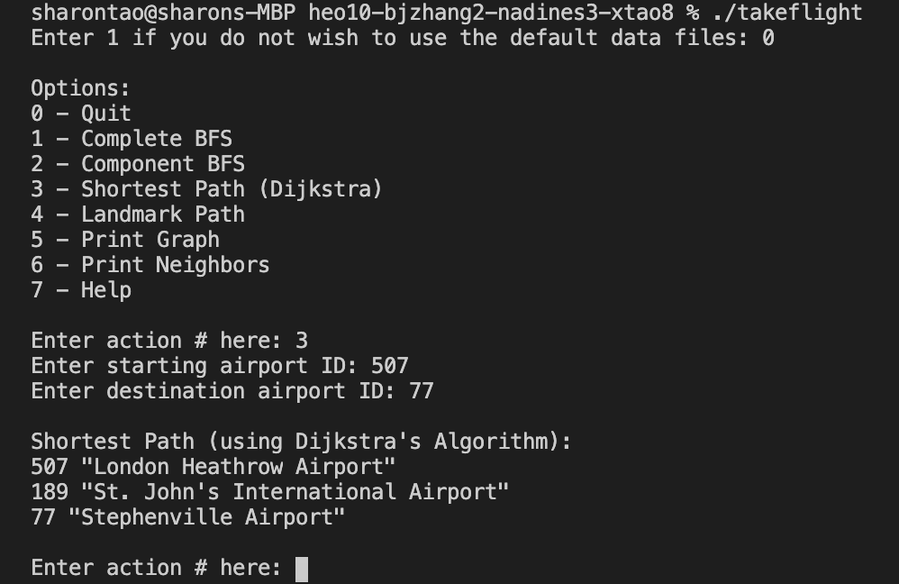

# TAKE FLIGHT 
------------

Introduction
------------
Take flight with us as we travel through airports in the most convenient way. Ever ponder your flight itenerary? Want to stop and visit somewhere on a connecting flight? We can take you from start to destination on the shortest flight plan! 

## Getting started
------------

Installation
------------
- Clone the Github repo: 
    - https://github-dev.cs.illinois.edu/cs225-fa20/heo10-bjzhang2-nadines3-xtao8.git
- Sample data is included once cloned, but updated data can be downloaded here:
    - https://openflights.org/data.html
- To import data into the project:
    - follow the instructions on the following website install Homebrew (https://brew.sh/) if not already installed
    - run the command *$ brew install wget* if not already installed and follow https://www.pair.com/support/kb/paircloud-downloading-files-with-wget/ for downloading files using wget

Usage
------------
This project takes data from OpenFlights airports and routes datasets, stored in the repo as routes.dat and airports.dat. These datasets are formatted as such in comma-separated lists, each airport/route on a different line:
- Airport database: airport ID, name, city, country, IATA, ICAO, latitude, longitude, altitude, timezone, DST, Tz database time zone, type, source
- Route database: airline, airline ID, source airport, source airport ID, destination airport ID, codeshare, stops, equipment

Make and run the executable *./takeflight* to begin. You will then have the option to use your own data file or use the default files. Once chosen, a menu should pop up with options to explore the data. Then enter inputs for the following requests to get the corresponding result.

